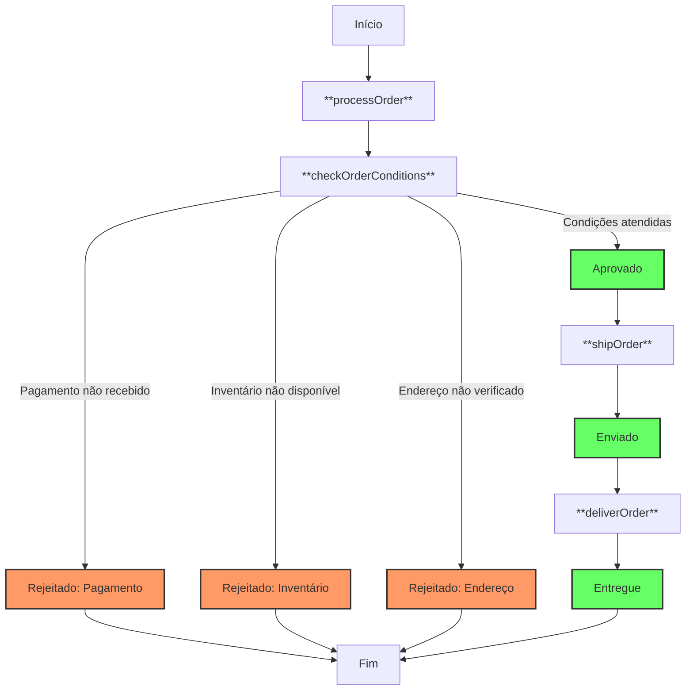

**Exemplo de diagrama mermaid gerado a partir de Quick Command da Stack Spot**

```mermaid
flowchart TD
    A[Início] --> B[**processOrder**]
    B --> C[**checkOrderConditions**]
    C -->|Pagamento não recebido| D[Rejeitado: Pagamento]
    C -->|Inventário não disponível| E[Rejeitado: Inventário]
    C -->|Endereço não verificado| F[Rejeitado: Endereço]
    C -->|Condições atendidas| G[Aprovado]
    G --> H[**shipOrder**]
    H --> I[Enviado]
    I --> J[**deliverOrder**]
    J --> K[Entregue]
    D --> L[Fim]
    E --> L
    F --> L
    K --> L

    style D fill:#f96,stroke:#333,stroke-width:2px
    style E fill:#f96,stroke:#333,stroke-width:2px
    style F fill:#f96,stroke:#333,stroke-width:2px
    style G fill:#6f6,stroke:#333,stroke-width:2px
    style I fill:#6f6,stroke:#333,stroke-width:2px
    style K fill:#6f6,stroke:#333,stroke-width:2px
```

